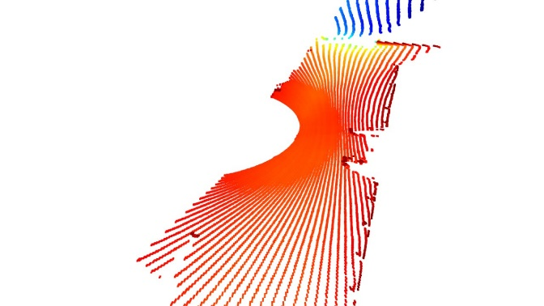
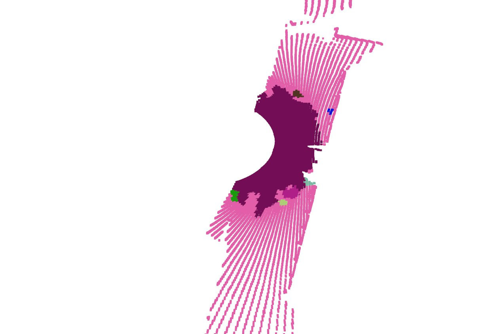
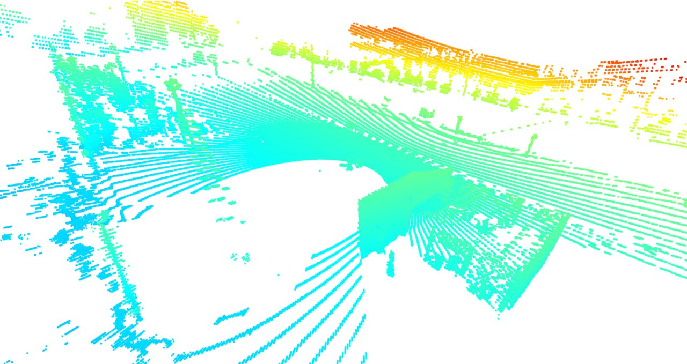
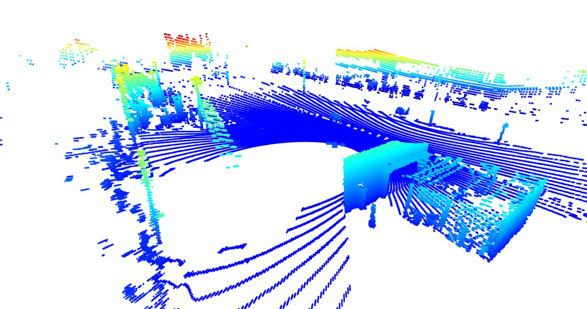
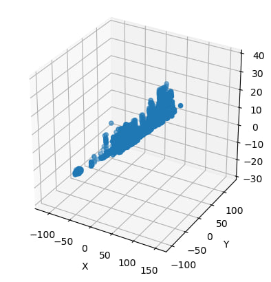

# Road-Surface Defect Detection (LiDAR, label-free)

A **compact hackathon solution** that turns raw LiDAR frames into GPS-tagged pothole alerts – with **zero manual labels**.  
Everything you need lives in the `road_defects/` package and a short CLI:

```bash
python -m road_defects.cli \
    --points ./data/points   # *.bin frames
    --gps    ./data/gps.csv
```

<sub>*Single-purpose, no heavy infra. Clean Python 3.11, Open3D 0.18 & NumPy only.*</sub>

---

## 1  Problem statement
Detect depressions or cracks in asphalt **before** they become safety hazards, even when the only inputs are:

* sequential **LiDAR frames** (`rowid_123.bin`, float32 XYZ);
* an optional **GPS log** mapping each frame to latitude / longitude.

---

## 2  Data snapshot

| Item          | Typical size | Notes                                                            |
| ------------- | -----------: | ---------------------------------------------------------------- |
| `rowid_*.bin` | 5 k - 50 k   | 48‑byte point records, no labels                                 |
| `gps.csv`     | = frames     | `points_file_path, latitude, longitude, altitude`                |

---

## 3  Pipeline overview

| # | Step | Illustration |
|:-:| ---- | ------------ |
| 1 | **Load & clean**  - read *.bin*, drop statistical outliers | - |
| 2 | **Merge frames** - Point‑to‑Point ICP → denser cloud | - |
| 3 | **Flatten ground** - RANSAC plane fit, rotate to XY | - |
| 4 | **Slice road layer** - keep densest Z-slice |  |
| 5 | **Detection zone** - crop dense area around vehicle |  |
| 6 | **Surface clustering** - DBSCAN on 10 % subsample -> dominant cluster | - |
| 7 | **4‑σ filter** - points > sigma deeper than mean -> potential defects | - |
| 8 | **Defect clustering & GPS tag** - tight DBSCAN, log coords | - |

---

## 4  Quick start

```bash
# 1 Install deps
pip install -r requirements.txt   # open3d, numpy, pandas, pytest

# 2 Process data
python -m road_defects.cli \
       --points ./your_frames \
       --gps    ./gps.csv

# 3 Tune sensitivity
#   sigma        = 2.0  shallower defects
#   eps_sample   = 0.30 looser DBSCAN on surface
#   eps_defect   = 0.09 looser DBSCAN on defects
```

Unit‑tests (`pytest`) provide a smoke‑check that the package imports and config instantiates.

---

## 5  Challenges & fixes

| Issue | Mitigation | Before | After |
|-------|-----------|--------|-------|
| Low point density | merge 75 frames via ICP | - | - |
| Z-axis spikes | plane fit + rotation |  |  |

3‑D view of raw cloud:  


---

## 6  Key takeaways

* **Label‑free still works** - density + sigma‑rules + DBSCAN catch obvious potholes in minutes.  
* **Less code > more code** - < 300 lines beat heavier pipelines for hackathon speed.  
* **Config first** - all hyper‑params in one dataclass; no magic numbers.

---

## 7  Tech stack

* Python 3.11, Open3D 0.18, NumPy, Pandas  
* No ROS, CUDA or web‑UI - built for quick offline inspection.

---

## 8  Credits

* Original LiDAR samples courtesy of the hackathon organisers.  
* Thanks to the PyData & Open3D communities.

---

*Written in 2025 by Heinrich Wirth*
